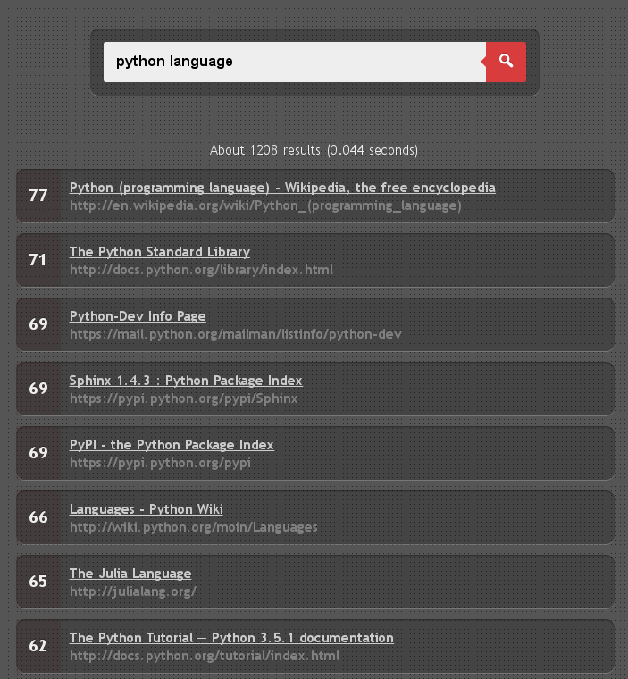

# Web crawler and search engine

[Report (ru)](docs/ru/report/index.pdf).

Ranking functions:
- BM25 (for whole content and headers only)
- PageRank
- Reference rating
- Query position
- Length of document

Architecture of the crawler:

Search page:

Efficiency (1.6GHz i5 + SSD + 4Mbit/s):
- Indexing: ~50'000 per hour pages.
- Search: ~0.1s per query on database with 1'000'000 indexed pages.

## License
The source code is licensed under [MIT license](http://opensource.org/licenses/mit-license.php).

The report and slides are not licensed (no rights are given to reproduce or modify this work).
